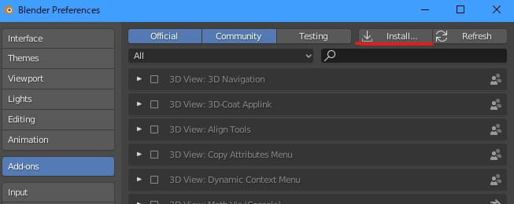
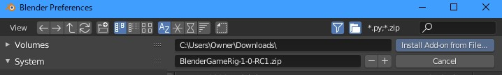
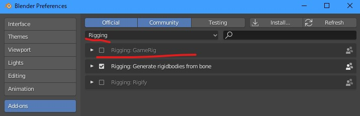
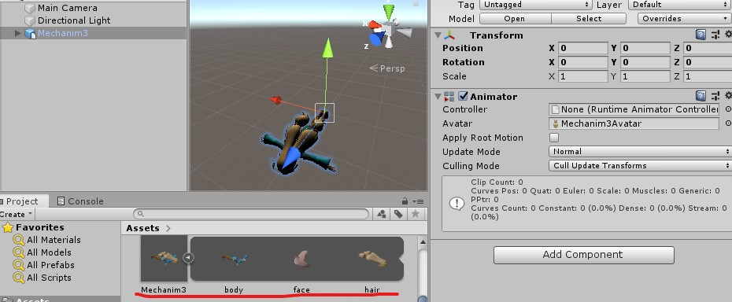
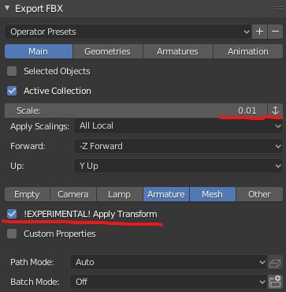
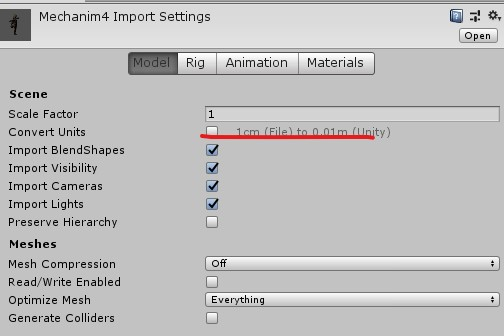

# 

*他の言語で読む: [English](README.md), [日本語](README.ja.md).*

## Blender 2.80 対応 リギング アドオン

ゲームなどリアルタイムコンテンツ制作向けのリギングフレームワークです。

標準アドオンの[rigify](https://archive.blender.org/wiki/index.php/Extensions:2.6/Py/Scripts/Rigging/Rigify/)をベースに作られました。

<!-- TOC -->

- [使い方](#使い方)
  - [GameRigをインストールする](#gamerigをインストールする)
  - ['メタリグ' を追加する](#メタリグ-を追加する)
  - [メタリグを調整する](#メタリグを調整する)
    - [追加のボーンを追加する](#追加のボーンを追加する)
  - [リグ生成](#リグ生成)
  - [リグの再生成](#リグの再生成)
- [Rigifyとの違い](#rigifyとの違い)
  - [階層がきれい](#階層がきれい)
  - [マルチ Face リグ](#マルチ-face-リグ)
  - [物理シミュレーションとアニメーションのブレンド（切り替え）機能がある](#物理シミュレーションとアニメーションのブレンド切り替え機能がある)
- [Tips](#tips)
  - [既存のアーマチュアをメタリグ化する](#既存のアーマチュアをメタリグ化する)
- [なぜ'Unity Mechanim/Human'メタリグはX軸90°の回転を持っているのか](#なぜunity-mechanimhumanメタリグはx軸90°の回転を持っているのか)
- [ライセンス](#ライセンス)

<!-- /TOC -->

## 使い方

### GameRigをインストールする

[このZIPファイル](https://github.com/SAM-tak/BlenderGameRig/releases/download/v1.0-RC1/BlenderGameRig-1-0-RC1.zip)をダウンロードします。

Blenderに戻ってプリファレンス・ウィンドウを開いて、'Install...'ボタンをクリックします。

先ほどダウンロードしたZIPファイルを選択して'Install add-on from File...'ボタンをクリックします。

GameRigがアドオン一覧に現れるので、チェックを入れて有効にします。

### 'メタリグ' を追加する

> モード: Object Mode
>
> ショートカット: ⇧ A
>
> メニュー: Add → Add Armature

### メタリグを調整する

metarig アーマチュアを編集して、適用したいモデルにボーンの位置合わせします。

ボーン変形のために頂点グループを設定します。

Rigifyと違い、GameRigはリグ生成時にボーンのリネームを行わないので、メタリグの時点でボーンの変形具合をテストできます。

#### 追加のボーンを追加する

モデルに髪の毛ボーンや補助ボーンなどが必要なら、それもメタリグに追加しておきます。

それらのボーンもリグ生成時にコピーされます。

コンストレイントやドライバーが設定されていても、ちゃんとそれごとコピーされます。

### リグ生成

準備ができたら、アーマチュア・プロパティー・タブにある'Generate New Rig'ボタンをクリックします。

これでリグが出来上がります。

メッシュオブジェクトを出来上がったリグにリンクします。

ポーズモードに入ると、生成されたリグのIK/FKブレンディングなどの様々な機能を使ってポージング・アニメーション制作ができます。

リグの独自パラメータや機能には、サイドバーのアイテムタブにある'GameRig Properties'パネルでアクセスできます。

### リグの再生成

ボーンの位置があってないな、と感じたら、メタリグを再編集する必要がありますが、メタリグを編集後素早くリグを再生成できます。

メタリグを再編集したら、'Regenerate rig'ボタンを押してリグに変更を反映できます。

> 注意:
>
> アクティブなコレクションが上書きしたいリグを含んでいるコレクションか確認してください。
>
> そうでないと、GameRigは新しいリグアーマチュアを制作してしまいます。
>
> 

## Rigifyとの違い

### 階層がきれい

GameRigは元のボーンをリネームしないし、デフォーム用ボーンをリグ生成時に追加する設計でなく、元のボーン階層にボーンを挟み込むということをしません。

よりゲーム開発やVRコンテンツ制作向きのリグを生成できます。

### マルチ Face リグ

face リグ がより柔軟です。

### 物理シミュレーションとアニメーションのブレンド（切り替え）機能がある

**'generic'** と **'tentacle'** リグはメタボーンにコンストレントがついていた場合、その結果の位置とキーアニメーションによる位置とをブレンドできます。

## Tips

### 既存のアーマチュアをメタリグ化する

普通のアーマチュアはGameRigのメタリグとして認識されないため、アーマチュア・プロパティー・タブにGameRigパネルが現れないため、メタリグのセットアップができません。

こういう場合はアーマチュア追加メニューから**Single Bone (metarig)を選んで追加**し、そのSingle Boneメタリグに既存のアーマチュアを**join** (**Ctrl + J / Menu Object→Join**)してください。

これでアーマチュア・プロパティー・タブにGameRigパネルが現れるようになり、

ボーン・プロパティー・タブからリグの設定が行えるようになります。

## なぜ'Unity Mechanim/Human'メタリグはX軸90°の回転を持っているのか

BlenderとUnityの座標系の違いから、BlenderでエキスポートしたfbxをUnityにインポートすると横倒しになってしまうので、それに対処するためです。(GameRigはメタリグと同じ回転をもったリグアーマチュアを生成します)

リグアーマチュアがX軸+90°の回転を、子のメッシュオブジェクトがX軸-90°の回転を持つようにし、更にFBX Exportの設定を:

- scale = 0.01
- 'Apply Unit'はオフ
- 'Apply Transform'はオン

とし、またUnity側のインポート設定を:

- Scale = 1.0
- 'Convert Unit'はオフ

としてエキスポート・インポートを行うと、横倒しにならず、かつインポートしたオブジェクトに余計な回転やスケールが一切ないようにできます。

> 付記:
>
> Blender 2.80 と Unity 2019.1 の組み合わせの場合。
>
> Blender 2.79 と Unity 2018.4 の頃は同じことをするのに違う設定を使っていました。

## ライセンス

[GNU GENERAL PUBLIC LICENSE](LICENSE)
