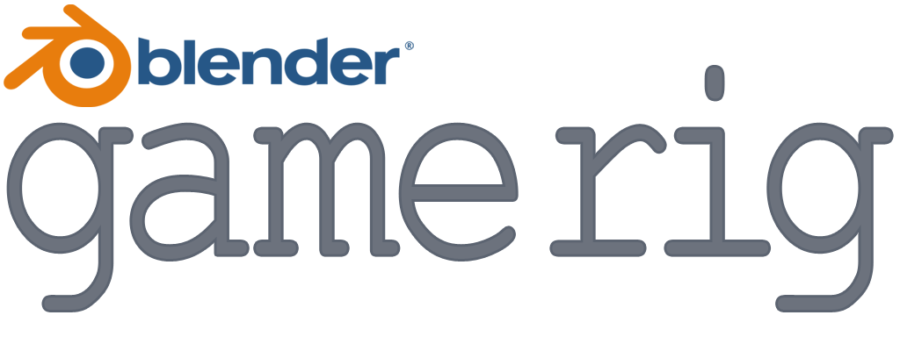
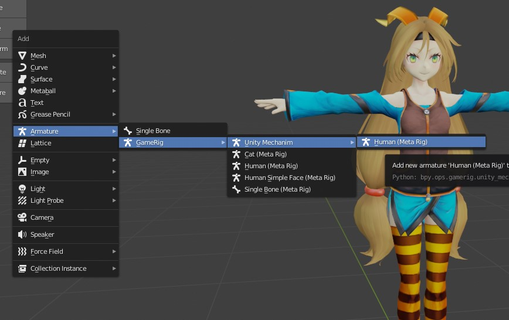
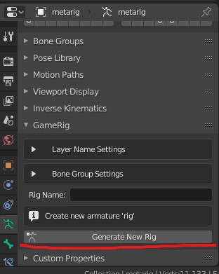
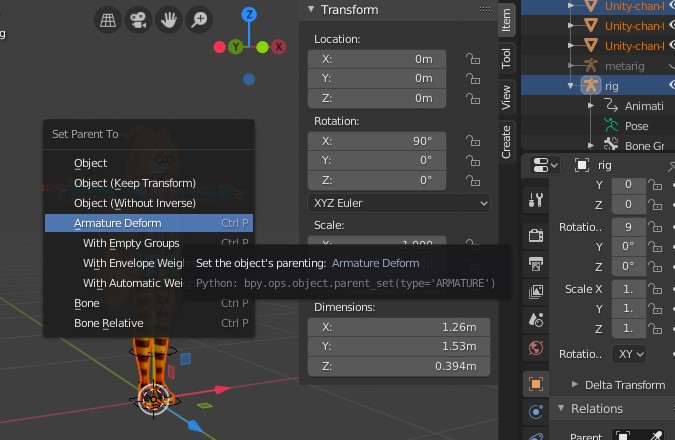
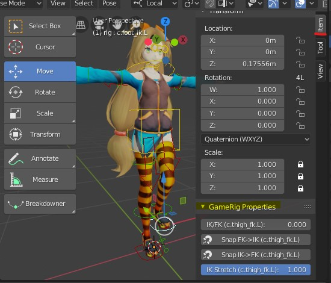
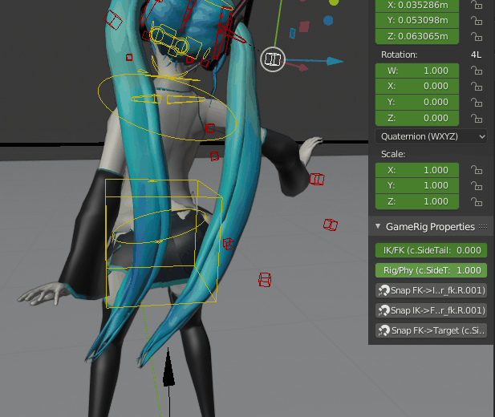

# 

*Read this in other languages: [English](README.md), [日本語](README.ja.md).*

## Rigging Add-on for Blender 2.80

Rigging framework for game / realtime content development. Hard fork from [Rigify](https://archive.blender.org/wiki/index.php/Extensions:2.6/Py/Scripts/Rigging/Rigify/) (official add-on).

<!-- TOC -->

- [!Blender GameRig](#blender-gamerig)
  - [Rigging Add-on for Blender 2.80](#rigging-add-on-for-blender-280)
  - [How to use](#how-to-use)
    - [Add 'metarig'](#add-metarig)
    - [Adjust metarig](#adjust-metarig)
      - [Add additional bones](#add-additional-bones)
    - [Generate rig](#generate-rig)
    - [Regenerate rig](#regenerate-rig)
  - [Deference from Rigify](#deference-from-rigify)
    - [Clean hierarchy](#clean-hierarchy)
    - [Multi Face Rig](#multi-face-rig)
    - [Blend animation and physic simulation result](#blend-animation-and-physic-simulation-result)
  - [Tips](#tips)
    - [How to use with an existing armature](#how-to-use-with-an-existing-armature)
  - [License](#license)

<!-- /TOC -->

## How to use

### Add 'metarig'

> Mode: Object Mode
>
> Hotkey: ⇧ A
>
> Menu: Add → Add Armature

### Adjust metarig

Edit metarig armature, let it fit to your model.

Set vertex group for armature deforming.

GameRig will copy bones without renaming differs from 'rigify', you can test armature deforming with metarig armature.

#### Add additional bones

If your model has hair / cloth / etc. bones, add these too.

These bones will be copied to generated rig.

If they have constraints, these constraints will be copied too with right target.

### Generate rig

When you are ready, click 'Generate New Rig' Button of Armature Properties tab.

Done.

Parent mesh objects to rig armature.

In pose mode, you can make pose or animation with generated rig featuring IK/FK blending, etc.

Rig's special parameters and functions will be available in 'GameRig Properties' panel that be placed on Item tab of Sidebar.

### Regenerate rig

If you feel some bones have bad positions, it means you need to edit metarig again, but you can regenerate rig quickly after edit metarig.

Edit metarig again, and click 'Regenerate rig' button to apply changes.

> Note:
>
> Please confirm current collection contains target rig to overwrite.
>
> Otherwise, gamerig generate a new rig to current active collection.
>
> 

## Deference from Rigify

### Clean hierarchy

GameRig dosen't rename original bones and dosen't add deform bone and dosen't insert any bones to original bone tree.

More suitable for game / VR content development.

### Multi Face Rig

More flexible face rig.

### Blend animation and physic simulation result

**'generic'** and **'tentacle'** rig can blend between own result and metabone's constraint result if metabone have constraint.

## Tips

### How to use with an existing armature

An armature not recognized as GameRig's metarig, the armature's properties panel has no GameRig panel.

Then you cannot setup metarig with existing armature.

In this case, **add 'Single Bone' metarig** and **join (Ctrl + J / Menu Object→Join) an existing armature to it**. And remove 'root' bone from metarig if you don't need it.

Gamerig panel will be available in armature properties panel.

In pose mode, you can set rig parameter in GameRig Rig Type panel that be placed on bone properties tab.

## License

[GNU GENERAL PUBLIC LICENSE](LICENSE)
